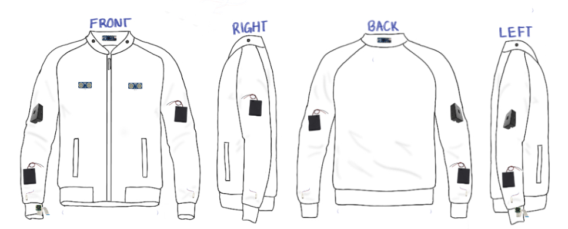
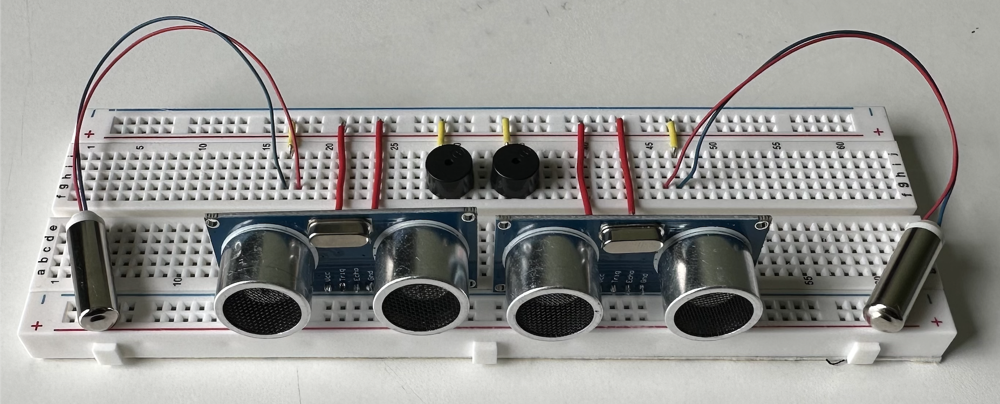
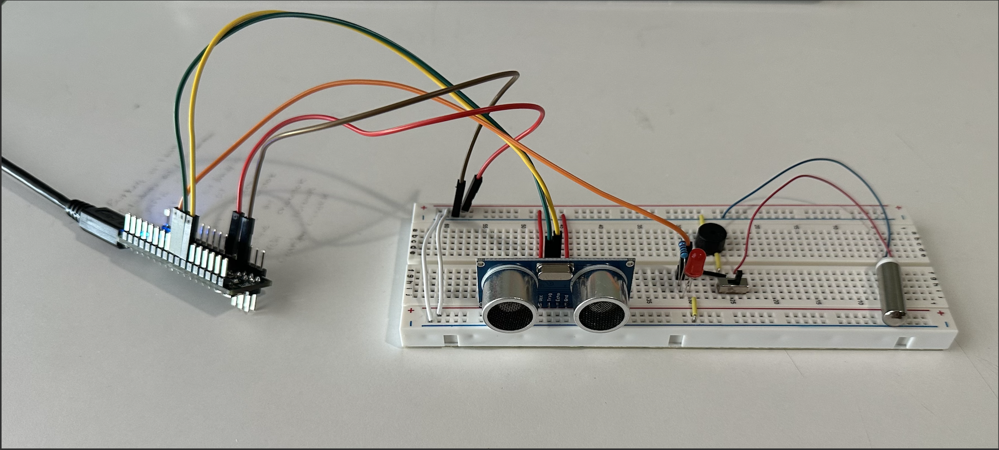
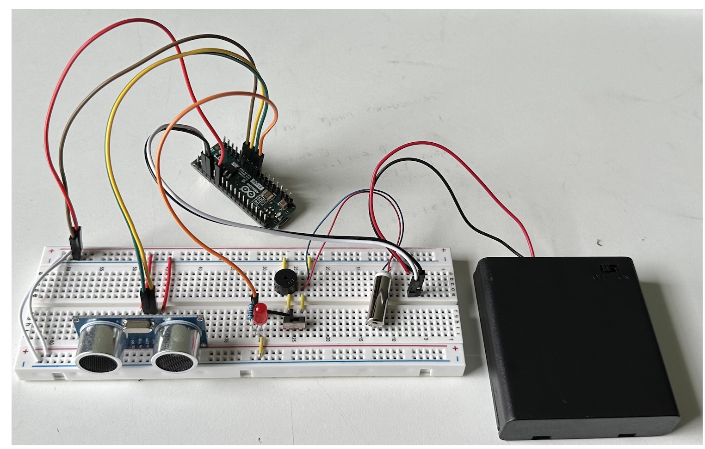
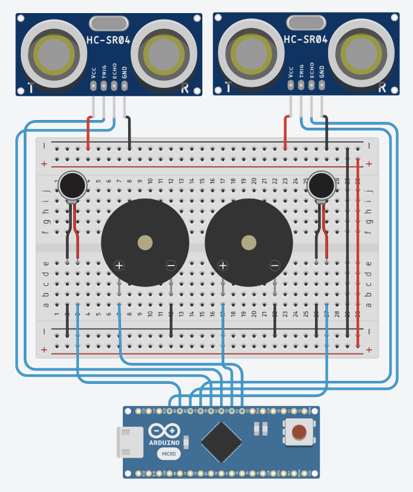
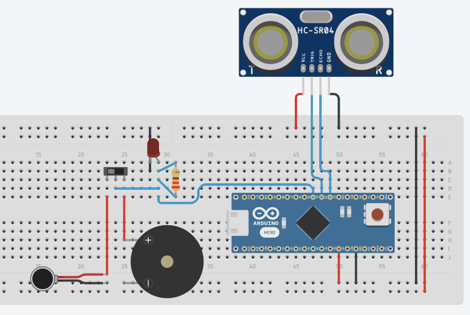

# Assistive Smart Jacket

| **Engineer** | **School** | **Area of Interest** | **Grade** |
|:--:|:--:|:--:|:--:|
| Anvika V | Princeton Day School | Computer Engineering | Incoming Senior |


  
# Final Milestone
<!-- For your final milestone, explain the outcome of your project. Key details to include are:
- What you've accomplished since your previous milestone
- What your biggest challenges and triumphs were at BSE
- A summary of key topics you learned about
- What you hope to learn in the future after everything you've learned at BSE

Adding to jacket
Creating two circuits > all soldered and ready to pop in jacket
Having buzzer at the collar 
Camera at the hand
Vibrating motor at the wrist 
Sparkly? Most individuals with blindness can see very reflective objects, such as things covered in sparkles (85%)

**Don't forget to replace the text below with the embedding for your milestone video. Go to Youtube, click Share -> Embed, and copy and paste the code to replace what's below.**

<iframe width="560" height="315" src="https://www.youtube.com/embed/F7M7imOVGug" title="YouTube video player" frameborder="0" allow="accelerometer; autoplay; clipboard-write; encrypted-media; gyroscope; picture-in-picture; web-share" allowfullscreen></iframe>
-->
## Schematics Part 3


# Second Milestone


<!---->

  The first modification I implemented started from the idea of a text-to-braille translator. I planned to use Raspberry Pi OpenCV to read text and use an Arduino Micro to control a braille display. However, with the idea of this display came a plethora of technical problems. Creating a display small enough to be portable and lightweight while still translating more than a sentence at a time into braille would require extremely small motors and sensors. Then came the development of a Morse Code translator using the same vibrating motor from the base project. 

## Second Milestone Code for Morse Code Translator (Arduino)
```c++
int vMotor = 4;
char* letters[] = {
".-", "-...", "-.-.", "-..", ".", "..-.", "--.", "....", "..", // A-I
".---", "-.-", ".-..", "--", "-.", "---", ".--.", "--.-", ".-.", // J-R 
"...", "-", "..-", "...-", ".--", "-..-", "-.--", "--.." // S-Z
};
char* numbers[] = { "-----", ".----", "..---", "...--", "....-", ".....", "-....", "--...", "---..", "----."};
int dotDelay = 200;

void setup() 
{
  pinMode(vMotor, OUTPUT);
  Serial.begin(9600);
  Serial.print("--------------------------------------");
  Serial.println();
  Serial.print("Enter text:");
}

void loop() 
{
  char ch;
  if (Serial.available())
  {
    ch = Serial.read(); // read a single letter if (ch >= 'a' && ch <= 'z')
    Serial.print(ch);
    if (ch >= 'a' && ch <= 'z')
    {
      flashSequence(letters[ch - 'a']);
    }
    else if (ch >= 'A' && ch <= 'Z') 
    {
      flashSequence(letters[ch - 'A']); 
    }
    else if (ch >= '0' && ch <= '9') 
    {
      flashSequence(numbers[ch - '0']); 
    }
    else if (ch == ' ') 
    {
      delay(dotDelay * 4);
    }
  }
  //Serial.println();
  //Serial.print("Enter text:");
  //Serial.println();
}

void flashSequence(char* sequence) 
{
  int i = 0;
  while (sequence[i] != NULL) 
  {
    flashDotOrDash(sequence[i]);
    i++; 
   }
  delay(dotDelay * 3);
}

void flashDotOrDash(char dotOrDash) 
{
  digitalWrite(vMotor, HIGH); 
  if (dotOrDash == '.')
  {
    delay(dotDelay);
  }
  else // must be a - 
  {
    delay(dotDelay * 3); 
  }
  digitalWrite(vMotor, LOW); delay(dotDelay);
}   
```
  
  Later, I realized that Morse code, like Braille, is not an accessible method of communication; as a matter of fact, only 1% of the population can understand Morse code. So to complete this milestone, I decided to create a text-to-speech translator and control it with a Raspberry Pi. The first step was connecting my Pi to my computer remotely. I encountered a setback in this process when my computer (Mac OS) had trouble connecting to my Pi through a VNC Server and lagged noticeably when connected through a terminal. After 4 days of trying to debug the problem, I decided to reflash the SD card in the Pi and connect it to a monitor.
  
  After establishing a strong connection to the Pi, I started working on live text recognition using Python. I soon faced the issue of dealing with blurry photos that the Pi was unable to read. By manually adjusting the focus of the PiCam and going through several rounds of testing, I successfully converted text into speech. 
  
## Second Milestone Code for Live Text Reader (Raspberry Pi OpenCV)
```c++
```
  Description Comming Soon!


  Description Comming Soon!
## Schematics Part 2


<iframe width="560" height="315" src="https://www.youtube.com/embed/y3VAmNlER5Y" title="YouTube video player" frameborder="0" allow="accelerometer; autoplay; clipboard-write; encrypted-media; gyroscope; picture-in-picture; web-share" allowfullscreen></iframe>

# First Milestone


  The first step of this project is to develop a simple system that assists visually-impaired individuals navigate a space. It alerts the user of objects within a 70cm radius with either haptic or auditive feedback (a vibrating motor or buzzer). As the object gets closer to the user, the system responds with more frequent vibrating or buzzing; a toggle switch is used to change between the motor and the buzzer. Additionally, to establish a visual debugging method, the circuit has a 5mm red LED that lights up in harmony with haptic or auditive feedback. Next, I will expand this gadget to make it multi-functional, like adding a Raspberry PI to translate text into Morse code or attaching it to a jacket to make it a usable garment.

## First Milestone Schematics 


## First Milestone Code
```c++
  const int pingTrigPin = 3; //Trigger connected to PIN 3
  const int pingEchoPin = 2; //Echo connected to PIN 2
  const int buz = 4; //Buzzer connected to PIN 4
  
  void setup() 
  {
    Serial.begin(9600);
    pinMode(buz, OUTPUT);
    pinMode(pingTrigPin, OUTPUT);
    pinMode(pingEchoPin, INPUT);
  }
  
  void loop()
  {
    long duration, cm; //Variables for wave duration and wave distance   
    digitalWrite(pingTrigPin, LOW); //Confirming that the trigPin is clear   
    delayMicroseconds(2);
    digitalWrite(pingTrigPin, HIGH); //Generating a wave by setting trigPin to HIGH for 5 minroseconds and then back to low
    delayMicroseconds(5);
    digitalWrite(pingTrigPin, LOW);
    duration = pulseIn(pingEchoPin, HIGH); //Storing the travel time is variable duration
    cm = microsecondsToCentimeters(duration); //Converting to distance   
    if(cm<=70 && cm>0) //Makes the light blink faster when the distance is smaller --> starts blinking at 70cm
    {
      int d= map(cm, 1, 100, 20, 2000); //d stores a variable that reformats a range
      digitalWrite(buz, HIGH); //Turning light on for .1 second  
      delay(100);
      digitalWrite(buz, LOW); //Turning light off 
      delay(d); //Waiting for a time that corresponds to the variable cm
    }
    Serial.print(cm);
    Serial.print("cm");
    Serial.println();
    delay(100);
  }
  
  long microsecondsToCentimeters(long microseconds)
  {
    return microseconds / 29 / 2;
  }
```
<iframe width="560" height="315" src="https://www.youtube.com/embed/eLwhJpBoEEo" title="YouTube video player" frameborder="0" allow="accelerometer; autoplay; clipboard-write; encrypted-media; gyroscope; picture-in-picture; web-share" allowfullscreen></iframe>

## First Milestone Bill of Materials
| **Part** | **Note** | **Price** | **Link** |
|:--:|:--:|:--:|:--:|
| Arduino Micro | Microcontroller | $24.90 | <a href="https://www.digikey.com/en/products/detail/arduino/A000053/4486332?s=N4IgTCBcDaIIwAYCsCC0iBsHUDsAmIAugL5A"> DigiKey </a> |
| Ultrasonic Sensor | Object Detection | $9 | <a href="https://www.amazon.com/Smraza-Ultrasonic-Distance-Mounting-Duemilanove/dp/B01JG09DCK/"> Amazon </a> |
| Vibrating Motor | Haptic Feedback | $11 | <a href="https://www.amazon.com/tatoko-vibration-Waterproof-8000-16000RPM-toothbrush/dp/B07KYLZC1S/"> Amazon </a> |
| Buzzer | Auditive Feedback | $7 | <a href="https://www.amazon.com/mxuteuk-Electronic-Computers-Printers-Components/dp/B07VK1GJ9X/"> Amazon </a> |
| 5mm Red LED | Visual Troubleshooting  | $6 | <a href="https://www.amazon.com/Diffused-Lighting-Electronics-Components-Emitting/dp/B01C3ZZT0A/"> Amazon </a> |
| Slide Switch | Selecting Haptic of Auditive Feedback  | $6 | <a href="https://www.amazon.com/HiLetgo-SS-12D00-Toggle-Switch-Vertical/dp/B07RTJDW27/"> Amazon </a> |
| 220Ω Resistor | Limiting Current to LED | $5.99 | <a href="https://www.amazon.com/MCIGICM-Values-Resistor-Assortment-Resistors/dp/B06WRQS97C/ref=asc_df_B06WRQS97C/?tag=hyprod-20&linkCode=df0&hvadid=312303208923&hvpos=&hvnetw=g&hvrand=2879797771863936635&hvpone=&hvptwo=&hvqmt=&hvdev=c&hvdvcmdl=&hvlocint=&hvlocphy=9003932&hvtargid=pla-586932991178&psc=1"> Amazon </a> |
| Breadboard | Intial Circuit Base | $9.99 | <a href="https://www.amazon.com/EL-CP-003-Breadboard-Solderless-Distribution-Connecting/dp/B01EV6LJ7G/ref=sr_1_11?keywords=solderless+breadboard&qid=1685564152&sr=8-11%20soldering%20kit11Amazonhttps://www.amazon.com/Soldering-Iron-Kit-Temperature-Desoldering/dp/B07S61WT16/ref=sxts_b2b_sx_reorder_acb_business"> Amazon </a> |
| Jumper Cables | Connecting Wires | $13.35 | <a href="https://www.amazon.com/QISF-Breadboard-Preformed-Anti-Static-Electronics/dp/B088WNZXFQ/ref=sr_1_6_sspa?crid=3BVYVZGBE5A3Z&keywords=boardboard+with+jumper+wires&qid=1686002634&sprefix=boardboard+with+jumper+wires%2Caps%2C83&sr=8-6-spons&psc=1&spLa=ZW5jcnlwdGVkUXVhbGlmaWVyPUFOWlRORjRCRUVHQTcmZW5jcnlwdGVkSWQ9QTA5Mjc5NjkxUktLUFAyVVJYRVBGJmVuY3J5cHRlZEFkSWQ9QTA5ODUyMjIyQ0IwTDM3VzIwQkFKJndpZGdldE5hbWU9c3BfbXRmJmFjdGlvbj1jbGlja1JlZGlyZWN0JmRvTm90TG9nQ2xpY2s9dHJ1ZQ=="> Amazon </a> |
